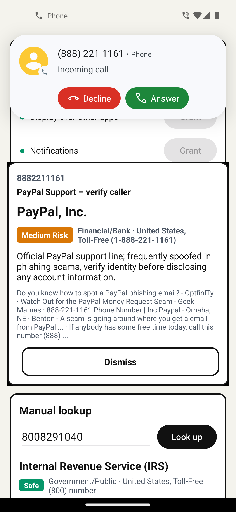
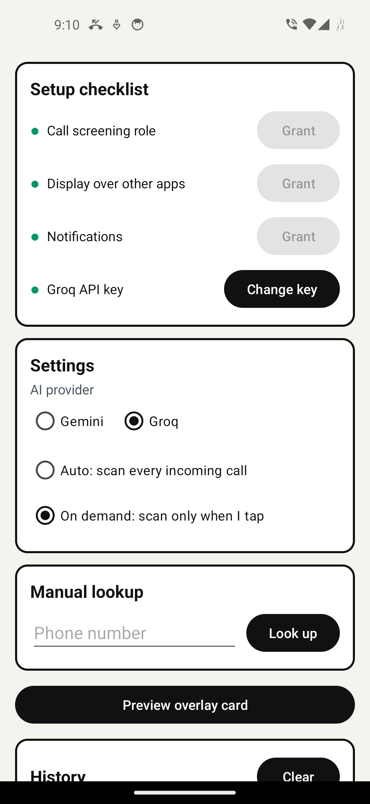

# AI Caller ID

AI Caller ID is a free and open-source Android app that tells you who is calling before you pick up. When a call rings, Android hands the number to the app through the call-screening API, the app asks an AI provider (using your own API key) to look the number up on the web, and the result appears as a floating card over the incoming-call screen: name, category, risk badge, location, a one- or two-sentence summary, and the sources it used. There is no app server, no account and no tracking; the only network traffic is the HTTPS request from your phone to the provider you chose.

<p>
  
  &nbsp;&nbsp;
  
</p>

## How it works

**At ring time**

1. Android's `CallScreeningService` passes the incoming number to the app. The app holds the *Caller ID & spam* role (`ROLE_CALL_SCREENING`) for this. It never blocks, rejects or delays a call; it only reads the number.
2. If the number is already in the local cache, the card is shown immediately with no network request.
3. Otherwise the app sends one HTTPS request straight from the phone to the AI provider you selected, authenticated with your own API key. The provider runs a web search and returns a structured summary.
4. The result is shown on a floating overlay card (`SYSTEM_ALERT_WINDOW`): name, category, risk badge (Safe / Low / Medium / High Risk-Scam), location, short summary and the web sources used. If the overlay permission is missing, a notification is shown instead. The card dismisses itself after 45 seconds.

**Bring your own key, no server**

The app talks only to the provider you pick; nothing sits in between. Two providers are supported behind one interface:

| Provider | Model | Web search | Cost |
|---|---|---|---|
| Groq | `groq/compound-mini` (falls back to `groq/compound`) | built in | free tier, no credit card |
| Google Gemini | `gemini-3.7-flash` | Google Search grounding | grounding needs a billing-enabled key |

**Cache and history**

Every result is stored in a JSON file in the app's private storage (at most 200 entries). Repeat callers resolve instantly, offline, and cost zero API calls. The History screen lists past lookups and has a Clear button.

## Privacy

Exact data flow:

- **Sent over the network:** the phone number of the incoming call, in one HTTPS request to the AI provider you selected, with your API key in the request header. In *On demand* mode nothing is sent until you tap *Scan caller*. Withheld/private numbers are never looked up because there is nothing to send.
- **Stored on the device:** your API key(s) in `EncryptedSharedPreferences` (backed by the Android Keystore), your settings, and the lookup history file. Keys are never logged. If the Android Keystore is unavailable, keys fall back to ordinary app-private storage (still excluded from backup).
- **Sent to anyone else:** nothing. No analytics, no crash reporting, no ads, no accounts, no app server.

Permissions requested:

| Permission | Why |
|---|---|
| `INTERNET` | the lookup request to the provider |
| `SYSTEM_ALERT_WINDOW` | the floating card over the call screen |
| `POST_NOTIFICATIONS` | the fallback notification when the overlay is not allowed |
| Call screening role | receiving the incoming number from Android |

Not requested: `READ_CALL_LOG`, `READ_PHONE_STATE`, `READ_CONTACTS` or any other contacts or call-log access. The app has no Google Play Services dependency and runs on de-Googled phones, including e-ink phones such as the Hisense A5 series and Bigme devices.

Once a number leaves your phone it is handled under the provider's own terms. Read the privacy policy of the provider you choose (Groq or Google) before adding a key; the app cannot control what they do with request data.

## Install

- **F-Droid:** inclusion is pending.
- **IzzyOnDroid:** pulls the APKs published on GitHub Releases.
- **GitHub Releases:** download the APK from the [releases page](https://github.com/pcdeni/ai-caller-id/releases). [Obtainium](https://github.com/ImranR98/Obtainium) can track the repository and install updates.
- **Build from source:** see [Building](#building).

Requires Android 10 (API 29) or newer.

## Setup

The main screen shows a checklist; every row has to read *Done* before the app can work.

1. **Call screening role** - tap *Grant* and pick AI Caller ID as the Caller ID & spam app.
2. **Display over other apps** - tap *Grant* and allow the overlay. Without it the app falls back to notifications.
3. **Notifications** - tap *Grant* (runtime permission on Android 13+).
4. **API key** - choose a provider under *AI provider*, tap *Set key* and paste your key.

**Getting a Groq key (free):** sign in at https://console.groq.com/keys and create a key. The free tier needs no credit card. Recommended if you just want to try the app.

**Getting a Gemini key:** create a key at https://aistudio.google.com/app/apikey. Google Search grounding, which is what makes the lookup useful, is only available on billing-enabled keys. With a free key the grounded call returns HTTP 429; the app then retries without search and labels the result *no live search*, which is much less accurate.

**Scan modes**

- **Auto** - every incoming call is scanned as it rings.
- **On demand** - the card shows the number and a *Scan caller* button; nothing is sent until you tap it.

*Manual lookup* on the main screen lets you check any number without a call, and *Preview overlay card* shows the card with sample data.

## Testing on the emulator

Install the debug build on an Android emulator (API 29+), then grant the role and the overlay permission from your computer:

```
adb shell cmd role add-role-holder --user 0 android.app.role.CALL_SCREENING com.pcdeni.aicallerid
adb shell appops set com.pcdeni.aicallerid SYSTEM_ALERT_WINDOW allow
```

Simulate an incoming call and end it again:

```
adb emu gsm call 8009359935
adb emu gsm cancel 8009359935
```

Extended Controls > Phone in the emulator window does the same. *Manual lookup* and *Preview overlay card* work without any call.

## Building

Prerequisites: JDK 17 or newer (JDK 23 works), the Android SDK with platform 34, and a `local.properties` file containing `sdk.dir=<path to your SDK>` (gitignored; Android Studio creates it for you). The Gradle 8.11.1 wrapper is committed; AGP 8.7.3 and Kotlin 2.0.21 are resolved by Gradle.

The repository root is the Gradle project (`settings.gradle.kts` at root, single module `app`).

```
./gradlew assembleDebug
```

The APK is written to `app/build/outputs/apk/debug/`. On Windows use `gradlew.bat`.

**Release signing:** copy `keystore.properties.example` to `keystore.properties` (gitignored), point it at your own keystore and fill in the passwords, then run

```
./gradlew assembleRelease
```

Without `keystore.properties` the release build is unsigned. F-Droid builds and signs the app with its own key, so no keystore is needed for that channel.

## Limitations

- AI answers can be wrong or incomplete. Treat the card as a hint, not a verdict.
- Works best for businesses, institutions and known spam or scam lines. Private mobile numbers usually come back as *Unknown*.
- A lookup takes a few seconds, so the card may appear mid-ring. Cached numbers are instant.
- You are subject to your provider's rate limits; on free tiers a burst of calls can hit them.
- Gemini without a billing-enabled key runs without web search and is noticeably less useful.
- Android only. iOS does not allow third-party apps to do live lookups of this kind.

## Contributing

Issues and pull requests are welcome at https://github.com/pcdeni/ai-caller-id/issues. [ARCHITECTURE.md](ARCHITECTURE.md) describes the module layout, the `LookupClient` interface and the resource naming used throughout the code; please read it before making larger changes.

## License

GPL-3.0-or-later. See [LICENSE](LICENSE).
